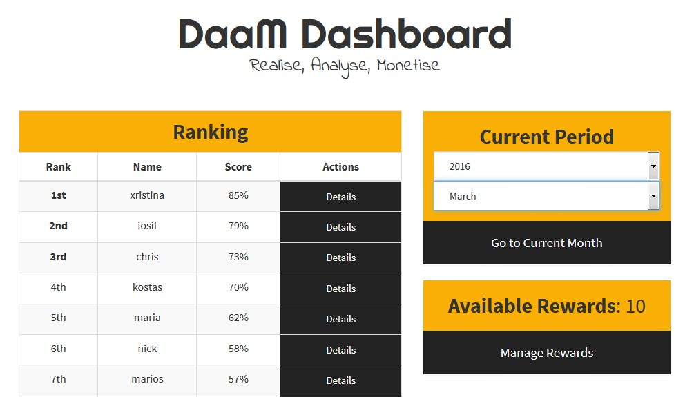

# **DaaM** - **D**riving **a**nalysis **a**nd **M**onetization

_________________________
**DaaM** is a driving analysis and monetization platform for car insurance companies and car owners as well.

Insurance companies can login via a webapp, see the driving behavior of their clients and choose rewards for the top drivers. The platform organizes the drivers in ranks with a sophisticated algorithm.

Users can see their rank and driving profile, rewards that they are eligible and notifications from the insurance company about new insurance offers via the mobile app provided.
